# Airodump-ng

Airodump-ng được sử dụng để bắt gói tin wifi và thích hợp để thu thập WEP IV.

## Bước 1 - Tìm đối tượng

Sử dụng **airodump-ng** để tìm kiếm các access point (AP) đang dùng mã hóa WEP:

```sh
$ airodump-ng wlan0mon
```

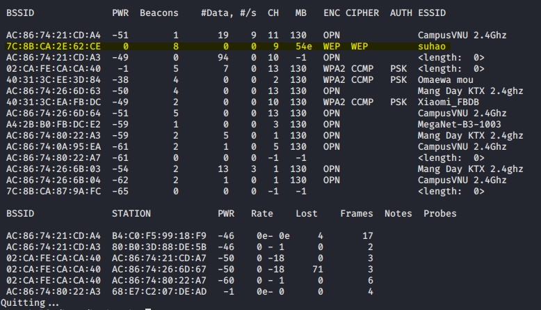

Các thông tin cần chú ý:

- BSSID: **7C:8B:CA:2E:62:CE**
- ESSID: **suhao**
- Channel: **9**

Chuyển channel của wlan0mon sang cùng channel với AP:

```sh
$ iwconfig wlan0mon channel 9
```

## Bước 2 - Kiểm tra packet injection

Bước này thực hiện để chắc chắn rằng card wifi đang nằm trong phạm vi của AP và có thể thực hiện packet injection vào nó.

```sh
aireplay-ng -9 -a 7C:8B:CA:2E:62:CE wlan0mon
```

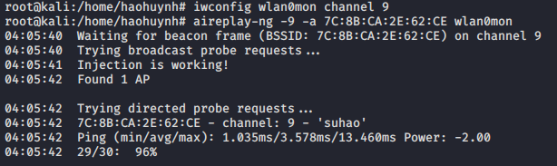

Nếu phần trăm kết quả trả về quá thấp hay bằng 0 thì packet injection sẽ không hoạt động.

## Bước 3 - Dùng airodump-ng để bắt WEP IVs

Ở bước này sử dụng công cụ **airodump-ng** để thu thập các IV được AP tạo ra.

```sh
$ airodump-ng -c 9 --bssid 7C:8B:CA:2E:62:CE -w output wlan0mon
```

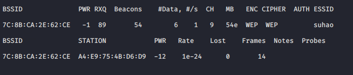

## Bước 4 - Sử dụng aireplay để fake authentication và chạy arp replay mode.

Bước này nhầm liên tục gửi lại cho AP các gói ARP, với mỗi lần trả lời broadcast gói ARP, AP sẽ tạo ra thêm các IV, vì thế sẽ giúp cho airodump-ng nhanh hơn trong việc thu thập IV.

Để được AP nhận gói, source MAC address phải được associated, nếu không AP sẽ bỏ qua. Dùng MAC của một máy associated (tìm trong mục hiển thị của airodump-ng) và dùng lệnh sau để fake authentication:

```sh
$ aireplay-ng -1 0 -a 7C:8B:CA:2E:62:CE -h A4:E9:75:4B:D6:D9 wlan0mon
```

Fake authentiacation thành công:

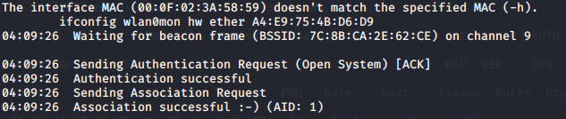

Chạy aireplay-ng ARP replay mode để thực hiện replay gói ARP liên tục (Nếu không nhận được gói ARP nào thì thực hiện deauthentication để khi các máy kết nối lại gửi ARP):

```sh
aireplay-ng -3 -b 7C:8B:CA:2E:62:CE -h A4:E9:75:4B:D6:D9 wlan0mon
```

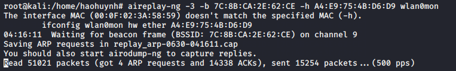

## Bước 5 - Dùng aircrack để tìm key

Với 64 bit key cần khoảng 20,000 packets. Khi đủ gói dừng airodump để có file cap (hoặc có thể dùng aircrack luôn mà chưa cần dừng phòng trường hợp chưa đủ IV).

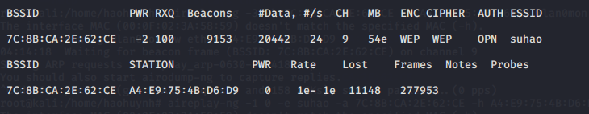

Chạy aircrack-ng với file output của airodump-ng để được kết quả.


# CommView

Đầu tiên, Start capture với Single channel mode (chọn channel của AP mục tiêu) trên CommView.

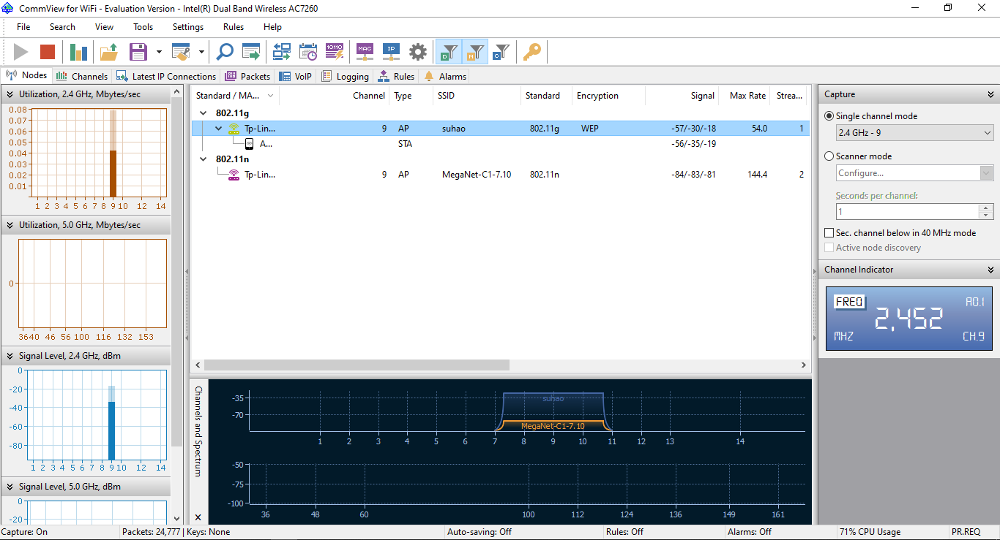

Sau đó, thực hiện fake authentication và arp replay như bước 4 của phần Airodump-ng để AP tạo ra nhiều IV hơn, đẩy nhanh quá trình thu thập IV.

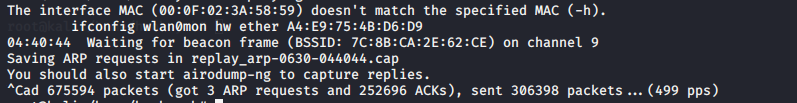

Trong quá trình thu thập Commview sẽ lưu lại các file log, tiến hành export những file log thành file cap để đưa vào aircrack.

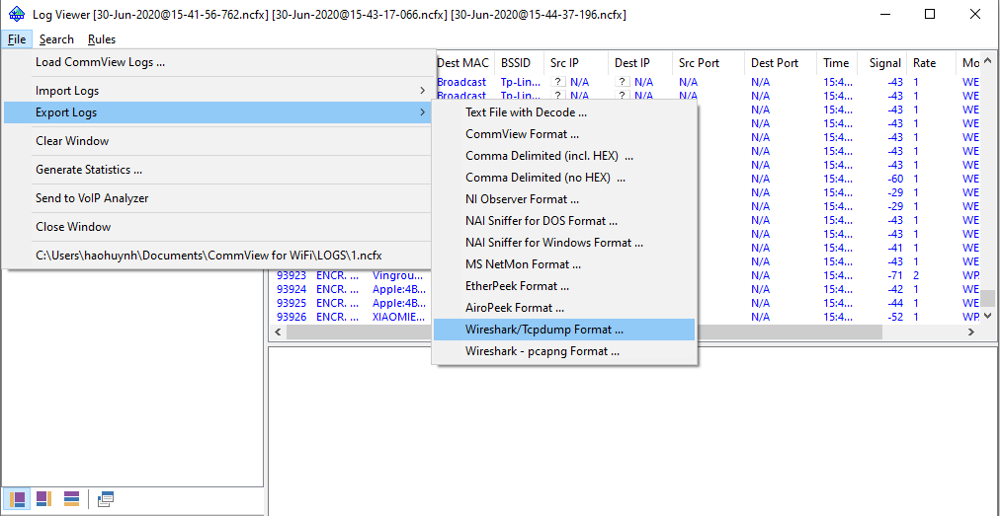

Thực hiện tìm key với aircrack-ng và file cap vừa export.

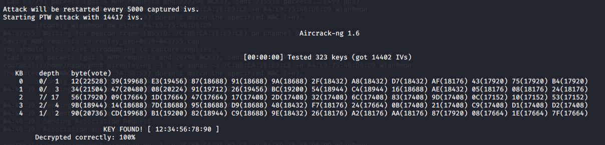

# Kismet

Kismet là công cụ để sniff Wifi Network, ngoài ra còn được dùng để bắt gói tin tương tự airodump-ng.

Mặc định các gói tin bắt với Kismet sẽ được lưu lại trong file log dạng kismet, vì vậy trước hết cần sửa dạng log thành pcapng (trong /etc/kismet/kismet_logging) để có thể dùng trong aircrack-ng:

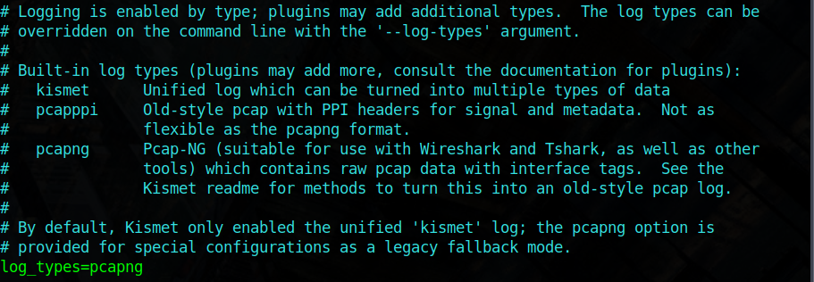

Giao diện chính của Kismet:

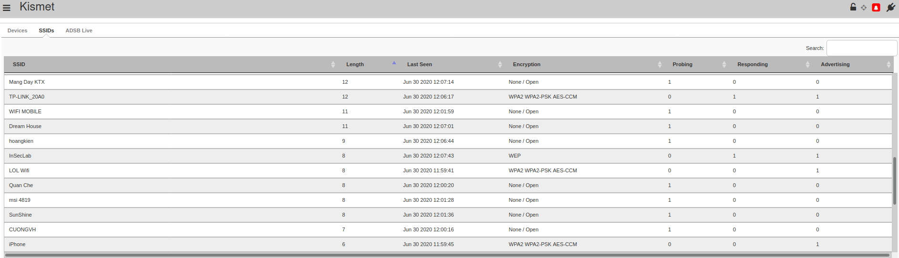

Tìm target và xem thông tin chi tiết:

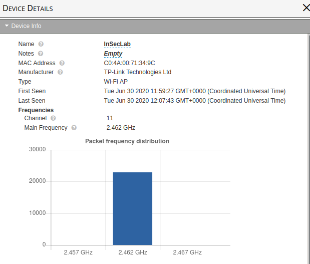

Khi đã biết các thông tin về AP, chỉnh sửa wlan0mon ở chế độ lock channel (chọn đúng channel của target):

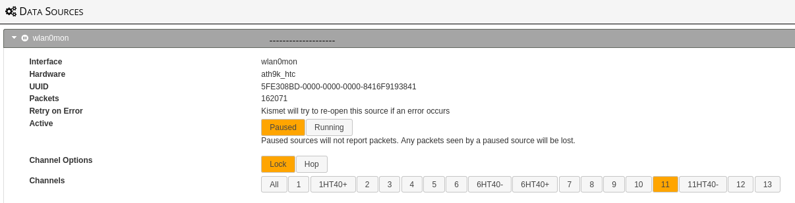

Cũng giống như các tool bên trên, chúng ta cần dùng aireplay ở chế độ ARP Replay để tăng tốc quá trình thu thập IV. Lúc này output của kismet là file pcapng, cần dùng tshark để chuyển thành dạng pcap để dùng trong aircrack-ng:

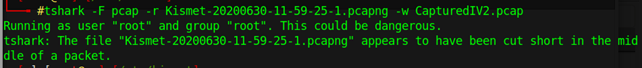

Dùng output này để sử dụng cho aircrack:

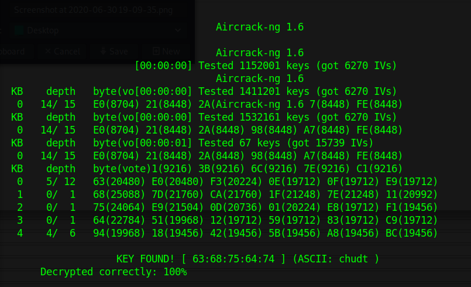

# Thực hiện với key ngẫu nhiên hơn

Thử với 64 bit key là: UIT@@

Chọn tool airodump để thực hiện. Nhưng với 20,000 IV vẫn chưa thể tìm được key:

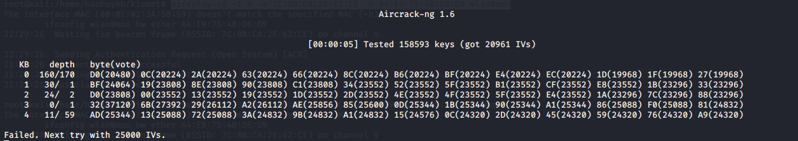

Tiếp tục để airodump-ng chạy đến khoảng 25,000 IV:

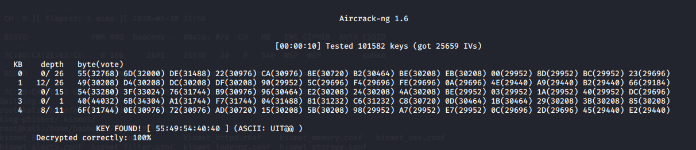
